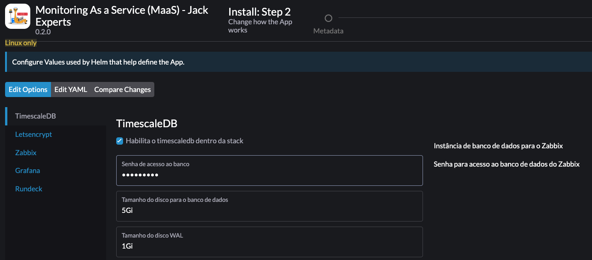

# Stack MaaS - Monitoring as a Service

[](https://opensource.org/licenses/Apache-2.0) 

Esse chart Helm define a stack MaaS (Monitoring as a Service) da Jack Experts e transforma-o em um self-service para quem utiliza Rancher.



## Instalação

    git clone https://github.com/JackExperts/helm-charts.git
    helm install charts/maas

## Configuração

Como configurar este chart Helm. 

<details>
  <summary>Banco de dados - TimescaleDB</summary>

  Parâmetro | Descrição | Valor padrão
  --------- | ----------- | -------
  timescaledb-single.enabled | Habilita o timescaledb | true
  timescaledb-single.clusterName | Nome principal do cluster | db-zabbix
  timescaledb-single.replicaCount | Quantiade de replicas do  | 1
  timescaledb-single.loadBalancer.enabled | Uso de loadBalancer | false
  timescaledb-single.backup.enabled | Habilita ou não o backup (se quiser habilitar, veja quais parâmetros precisam ser configurados no chart do ) | false
  timescaledb-single.secrets.credentials.PATRONI_SUPERUSER_PASSWORD | Senha de user postgres | db-zabbix
  timescaledb-single.secrets.credentials.PATRONI_REPLICATION_PASSWORD | Senha de replicacao | db-zabbix
  timescaledb-single.secrets.credentials.PATRONI_admin_PASSWORD | Senha do user patroni | db-zabbix
  timescaledb-single.persistentVolumes.data.enabled | Habilita persistência de dados | true
  timescaledb-single.persistentVolumes.data.size | Tamanho do disco de dados | 5Gi
  timescaledb-single.persistentVolumes.wal.enabled | Habilita persitência do WAL | true
  timescaledb-single.persistentVolumes.wal.size | Tamanho do disco do WAL | 1Gi
  timescaledb-single.resources.limits.cpu | Configuração de limite de CPU | 1
  timescaledb-single.resources.limits.memory | Configuração de limite de RAM | 2048Mi
  timescaledb-single.resources.requests.cpu | Configuração de reserva de CPU | 500m
  timescaledb-single.resources.requests.memory | Configuração de reserva de RAM | 1024Mi
  timescaledb-single.prometheus.enabled | Habilita o monitoramento por padrão | true
  timescaledb-single.prometheus.image.repository | Imagem do exporter prometheus | wrouesnel/postgres_exporter
  timescaledb-single.prometheus.image.tag | Tag da imagem do exporter prometheus | v0.7.0
  timescaledb-single.prometheus.image.pullPolicy | Política de download de imagem do exporter | IfNotPresent

</details>


<details>
  <summary>Configuração Letsencrypt</summary>

Parâmetro | Descrição | Valor padrão
  --------- | ----------- | -------
letsencrypt.enabled | Habilita a criação do ClusterIssuer | true
letsencrypt.name | Nome do Cluster Issuer | letsencrypt-maas
letsencrypt.mail | E-mail válido | 

</details>

<details>
  <summary>Job de criação da base do Zabbix</summary>

Parâmetro | Descrição | Valor padrão
  --------- | ----------- | -------
database.create | Habilita a criação da base ao instalar este chart | true
database.jobName | Nome do job | dbzabbixcreate

</details>

<details>
  <summary>Configuração Zabbix Server e Zabbix Web</summary>

Parâmetro | Descrição | Valor padrão
  --------- | ----------- | -------
zabbix.enabled | Habilita o Zabbix | true
zabbix.zabbixServer.replicaCount | Quantidade de rélicas | 1
zabbix.zabbixServer.hostPort | Uso de porta do tipo HostPport | true
zabbix.zabbixServer.image.repository | Imagem do Zabbix server  | zabbix/zabbix-server-pgsql
zabbix.zabbixServer.image.tag | Tag da imagem do Zabbix server | ubuntu-6.0.5
zabbix.zabbixServer.DB_SERVER_HOST | Host do Banco de dados | db-zabbix
zabbix.zabbixServer.POSTGRES_USER | Usuário de conexão ao banco | postgres
zabbix.zabbixServer.POSTGRES_PASSWORD | Senha de conexão ao banco | db-zabbix
zabbix.zabbixServer.POSTGRES_DB | Nome da base de dados | zabbix
zabbix.zabbixServer.service.type |  | ClusterIP
zabbix.zabbixweb.enabled | Tipo do service do Zabbix Web | true
zabbix.zabbixweb.image.repository | Imagem do Zabbix web | zabbix/zabbix-web-apache-pgsql
zabbix.zabbixweb.image.tag | Tag do Zabbix web | ubuntu-6.0.5
zabbix.zabbixweb.env | ENV para definir o nome | ```{name: ZBX_SERVER_NAME, value: ""}```
zabbix.zabbixweb.ZBX_SERVER_HOST | Endereço do Zabbix Server | zabbix-server
zabbix.zabbixweb.ZBX_SERVER_PORT | Porta do Zabbix Server | 10051
zabbix.zabbixweb.DB_SERVER_HOST | Endereço do banco de dados | db-zabbix
zabbix.zabbixweb.DB_SERVER_PORT | Porta de conexação com o banco de dados | 5432
zabbix.zabbixweb.POSTGRES_USER | Usuário do banco de dados | postgres
zabbix.zabbixweb.POSTGRES_PASSWORD | Senha do respectivo usuário de acesso ao banco de dados | db-zabbix
zabbix.zabbixweb.POSTGRES_DB | Nome da database | zabbix
zabbix.zabbixweb.service.type | Tipo do serviço do Zabbix web | ClusterIP
zabbix.ingress.enabled | Habilita ingress para o Zabbix web | true
zabbix.ingress.annotations.cert-manager.io/cluster-issuer | ClusterIssuer do letsencrypt | letsencrypt-maas
zabbix.ingress.annotations.kubernetes.io/ingress.class | Ingress class do cluster | nginx
zabbix.ingress.domain | Domínio a ser utilizado no ingress | example.local
zabbix.ingress.path | Contexto a ser utilizado | "/"
</details>


<details>
  <summary>Configuração Grafana</summary>

Parâmetro | Descrição | Valor padrão
  --------- | ----------- | -------
grafana.enabled | Habilita o Grafana | false
grafana.persistence.enabled | Habilita persistência para o Grafana | true
grafana.persistence.size | Tamanho do disco para persistir plugins, confs, etc. | 2Gi
grafana.adminUser | Usuário de acesso | admin
grafana.adminPassword | Senha padrão para o usuário de acesso | 
grafana.plugins | Lista de plugins que devem ser instalados | alexanderzobnin-zabbix-app
grafana.env.GF_PLUGINS_ALLOW_LOADING_UNSIGNED_PLUGINS | Lista de plugins permitidos (não assinados) | alexanderzobnin-zabbix-datasource
grafana.env.GF_SERVER_ROOT_URL | Endereço do endpoint do Zabbix | %(protocol)s://%(domain)s:%(http_port)s/dash/
grafana.env.GF_SERVER_SERVE_FROM_SUB_PATH | Env para permitir uso de subpath | true
grafana.datasources.datasources.yaml.apiVersion | ApiVersion do datasources | 1
grafana.datasources.datasources.yaml.datasources | Config do Datasource | Vide values.yaml
grafana.ingress.enabled | Habilita o ingress | true
grafana.ingress.hosts | Domínio de acesso ao Grafana | 
grafana.ingress.path | Path de contexto padrão de acesso | /dash
grafana.ingress.annotations.cert-manager.io/cluster-issuer | Nome do ClusterIssuer Letsencrypt | letsencrypt-maas
grafana.ingress.annotations.kubernetes.io/ingress.class | Nome do Ingress Class | nginx
</details>


<details>
  <summary>Configuração Rundeck</summary>

Parâmetro | Descrição | Valor padrão
  --------- | ----------- | -------
rundeck.enabled | Habilita o Rundeck | false
rundeck.rundeck.adminUser | Configuração de usuário admin | admin:admin,user,admin,architect,deploy,build
rundeck.rundeck.env.RUNDECK_GRAILS_URL | Configuração de url  | http://{{ .Release.Name }}.{{ .Release.Namespace }}.svc.cluster.local
rundeck.rundeck.env.RUNDECK_SERVER_FORWARDED | Env RUNDECK_SERVER_FORWARDED | true
rundeck.rundeck.env.RUNDECK_LOGGING_STRATEGY | Env RUNDECK_LOGGING_STRATEGY | CONSOLE
rundeck.ingress.enabled | Habilita o ingress para o Rundeck | true
rundeck.ingress.annotations.kubernetes.io/ingress.class | Ingress class do cluster | nginx
rundeck.ingress.annotations.cert-manager.io/cluster-issuer | ClusterIssuer letencrypt do cert-manager | letsencrypt-prod
rundeck.ingress.annotations.nginx.ingress.kubernetes.io/proxy-body-size | Body size da requisição | 200m
rundeck.ingress.annotations.nginx.ingress.kubernetes.io/proxy-read-timeout | Timeout de leitura da request | 600
rundeck.ingress.annotations.nginx.ingress.kubernetes.io/proxy-send-timeout | Timeout de envio da request | 600
rundeck.ingress.annotations.nginx.ingress.kubernetes.io/proxy-buffers-number | Número de buffers | 100
rundeck.ingress.annotations.nginx.ingress.kubernetes.io/proxy-buffer-size | Buffer size | 200m
rundeck.ingress.annotations.nginx.ingress.kubernetes.io/client-body-buffer-size | Buffer size do cliente | 200m
rundeck.ingress.paths | Contexto do Rundeck | /
rundeck.ingress.hosts | Domínio de acesso desejado | 
</details>


## TODO

- Criação do usuário no Zabbix via API para uso pelo Grafana;
- Subida de dashboards customizados no Grafana;

## Como contribuir

Abra uma issue, envie um PR ou entre em contato.

## Evolução

- Transformar a entrega do Zabbix no Kubernetes em um operator.
